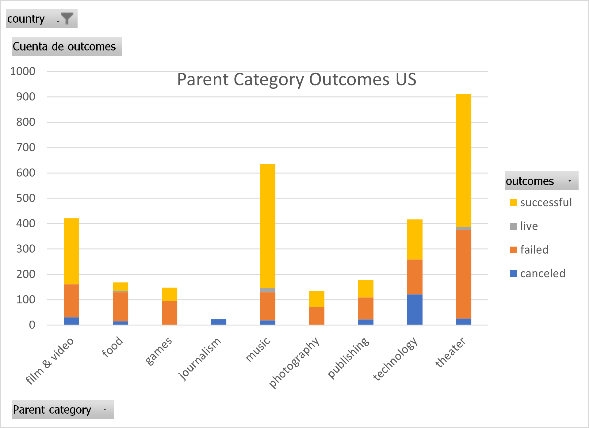
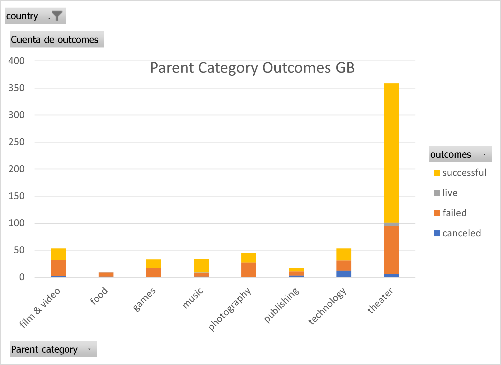
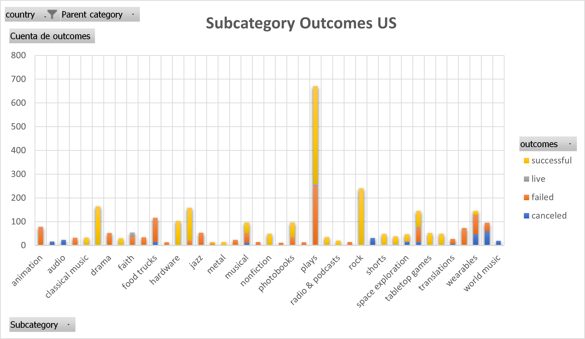
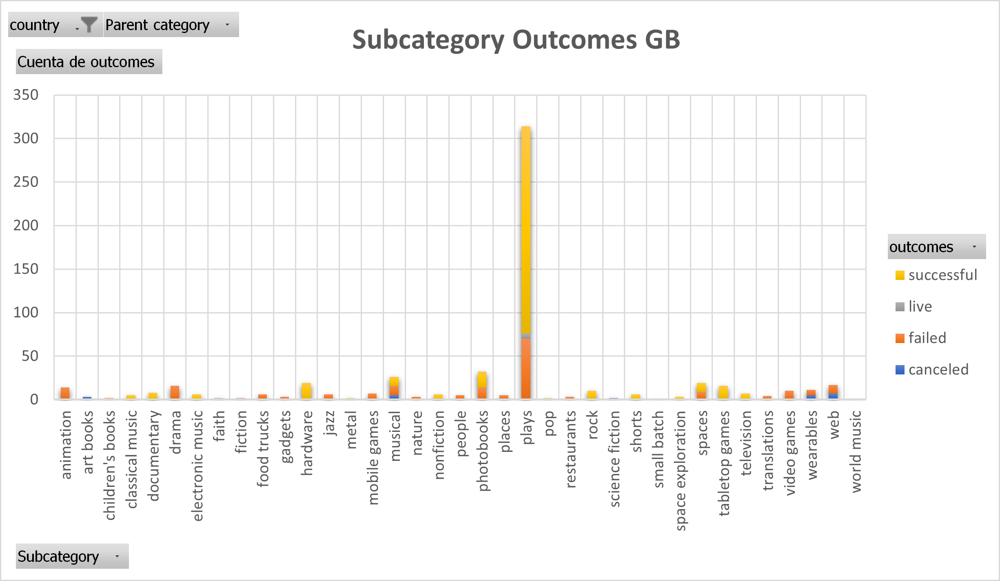
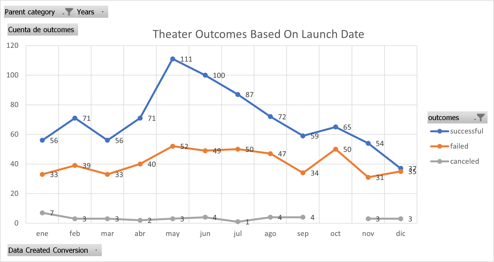
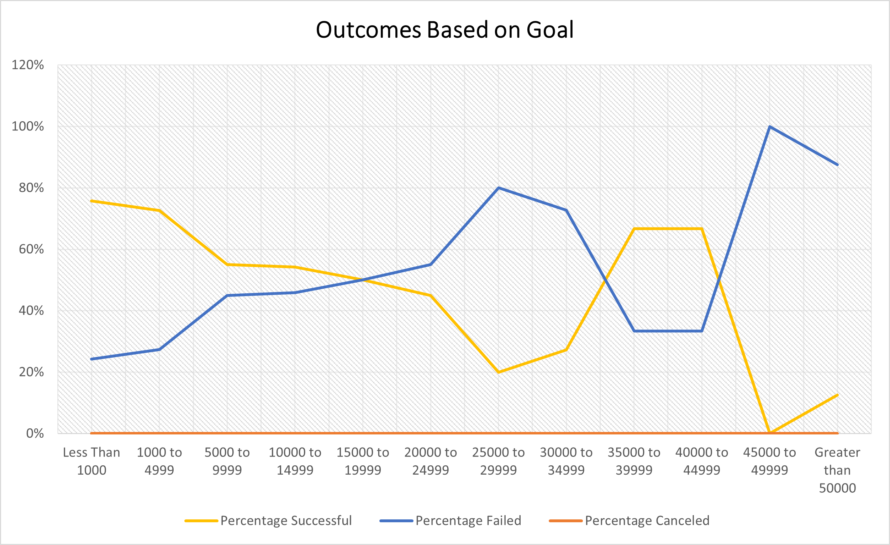

# An Analysis of Kickstarter Campaigns
Overview: 
Performing an exploratory analysis to several crowdfunding projects to uncover any hidden trends related to successful projects in the areas of music and theather plays. These finding will be presented in charts and graphs to help Louise to visualize better this patterns and present the findings in a simpler, and user-friendly way.
## Objective: 
In this analysis we will be helping Louise to uncover trends that successful campaigns have in common and help her establish a realistic funding goal, the best month to start her campaign and the rate of successful campaigns that are part of the same category as hers, and many other characteristics.

## Analysis and Methods:

In order to analyse the kickstarter database I implemented different filters to separate campaigns in different categories, the process was as follows:
* Using conditional formatting every cell in the “outcome” column was filled with a different color depending on the outcome, green was used for successful campaigns, red for failed campaigns, yellow for live campaigns and blue for cancelled campaigns.
* A new column with the name of **Percentage Funded** was created dividing the total amount of pledged money the campaign got by the original goal amount.
* In order to summarize what we found value shading was applied to the percentage funded column, the color of the cell changes from red to blue in ascending order of the percentage funded.
* A column named **Average donation** was created to have an idea of how much each backer of the project paid in average.

 

Posteriorly, campaigns were separated by the parent category **music** and the subcategory **plays**  in a pivot table and some column stacked pivot charts of the outcomes of the countries of the United States and Great Britain were created as shown in the images below.

Music category outcomes (US)   |  Music category outcomes (GB) 
:-------------------------:|:-------------------------:
   | 

Plays subcategory outcomes (US)  |  Plays subcategory outcomes (GB)
:-------------------------:|:-------------------------:
   | 
 

As we can see in the charts of the United States and Great Britain, theather is the category with most fundraising campaigns and one with the highest success numbers, and as we can see in the images of Subcategories, plays related campaigns are by far the most common cand with a high number of success cases. 
Because Loiuse have a particular interest in the performance of other plays, the **VLOOKUP** function was used in order to determine the pledged amount that the play had, the original goal, the number of bakcer and the average donation was determined for the next plays:

* Be Prepared
* Checkpoint 22
*	Cutting Off Kate Bush
*	Jestia and Raedon
*	The Hitchhiker's Guide to the Family

## Challenge Analysis:
To obtain further insights of the Kickstarter dataset an analysis of the duration of the campaigns needed to be performed, so the factors to analyse where:
*	Outcomes Based on Launch Date
*	Outcomes Based on Goals
Afterwards, the columns of “deadline” and “launch_at” containing timestamps were converted into normal date format and a pivot table containing months as row labels, the count of outcomes as columns as shown in the image below.

 

With this image we could infer that the months with more successful campaigns are May and June, and from then the number of successful campaigns start to decrease, we can also see that the number of failed campaigns maintains pretty much constant all over the year and that December is the launch month with less successful campaigns.
Lastly, in order to create a better analysis of the outcomes Based on Goals a new sheet was created with 8 columns:
*	Goal
*	Number Successful
*	Number Failed
*	Number Canceled
*	Total Projects
*	Percentage Successful
*	Percentage Failed
*	Percentage Canceled

In the goal column 12 ranges were created as follows:

*	Less than 1000
*	1000 to 4999
*	5000 to 9999
*	10000 to 14999
*	15000 to 19999
*	20000 to 24999
*	25000 to 29999
*	30000 to 34999
*	35000 to 39999
*	40000 to 44999
*	45000 to 49999
*	Greater than or equal to 50000

And then we obtained the number of successful, failed and canceled campaigns that had a goal amount in the defined ranges as shown in the image below.

 

And as shown in the line chart below can see in the table, campaigns with a goal higher to $45,000 have a very high chance of failing, whereas campaigns with a goal range between **$35,000** and **$45,000** have a chance of succeeding over **60%**

# Limitations
Since the data was recollected for the years of 2014 to 2017, there is not a real guarantee that the characteristics of the successful campaigns of these years will be valid nowadays, especially after SARS-CoV-2 pandemic. Also, campaigns with a goal amount in the range of $35,000 and $45,000 have a high success percentage, however, there are only 9 projects of 1047 done with this ranges, so this is not a very significant value, so more data needs to be measured.
# Recommendations
I will recommend to further dig into the subcategory of **plays** since the project that Louise wants to implement is from this category, I will add a graph of successful campaigns depending on their launch dates to see if there is any difference between the results obtained of the outcomes by launch date in every Kickstarter campaign. It would be a good idea of the number of backers that the project would need and their possible average donation to help people visualize the big picture of the project and reduce uncertainty.
